GG_Vault
========

GG_Vault serve como espaço de documentação dentro do Obsidian para os projetos e ferramentas desenvolvidos na Gaz Games.

Requisitos
----------
- Recomendado ter instalado [7-Zip](https://www.7-zip.org/), [WinRAR](https://www.win-rar.com/) ou outro programa similar
- Conta no [Github](https://github.com/). Em caso de dúvida, use o [guia oficial](https://docs.github.com/en/get-started/start-your-journey/creating-an-account-on-github)
- Entrar na organização da GazGames no Github. Em caso de dúvida, use o [guia oficial](https://docs.github.com/en/organizations/collaborating-with-groups-in-organizations/about-organizations)
- Instalar o [Git](https://git-scm.com/). Em caso de dúvida, use o [guia oficial](https://git-scm.com/book/en/v2/Getting-Started-Installing-Git)
	- Na instalação do *Git* é recomendado marcar na tela de Componentes a opção *Add a Git Bash Profile to Windows Terminal*

	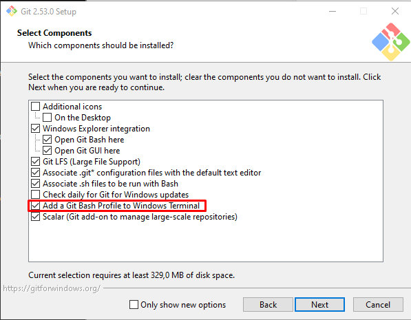
	-  Na instalação do *Git* também é recomendado marcar a opção *Override the default branch name for new repositories* e deixar o valor padrão de *"main"*

	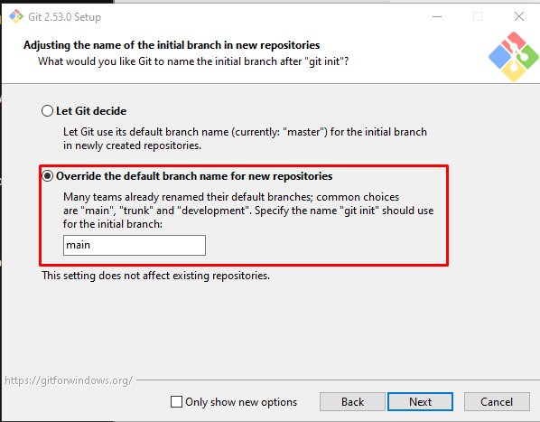
	- As demais opções do instalador não precisam de nenhuma alteração.
- Instalar o [Obsidian](https://obsidian.md/). Em caso de dúvida, use o [guia oficial](https://help.obsidian.md/install)


Instalação e Configuração
-------------------------
Para utilizar o GG_Vault é necessário baixar o USER_Vault mais recente presente em [Releases](https://github.com/GazGamesOrganization/GG_Vault/releases). Esse arquivo é uma Vault do Obsidian já pré configurada com o plugin [*Obsidian Git*](https://github.com/Vinzent03/obsidian-git) e com o repositório do **GG_Vault** já clonado.

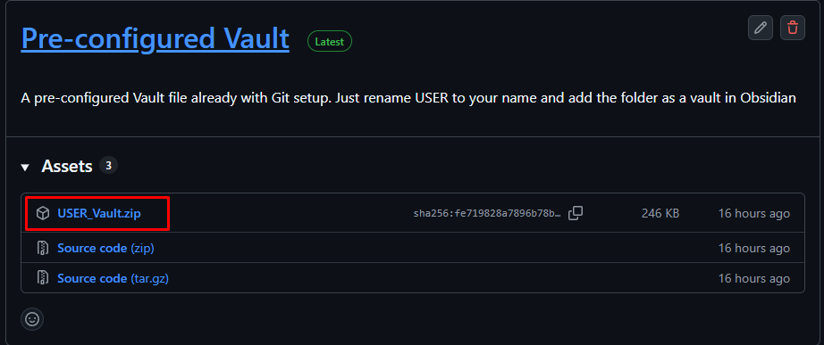

Após baixar o ***USER_VAULT.zip*** basta extrai-lo no local do seu computador onde você quer armazenar sua Vault do Obsidian.

**Se seu computador tiver mais de um disco, priorize instalar em um que não possua a instalação do Windows a fim de poupar espaço para o sistema**

No exemplo abaixo, foi instalado em `Documentos/Obsidian/Vaults` e foi utilizado o ***7-Zip*** na extração do arquivo.

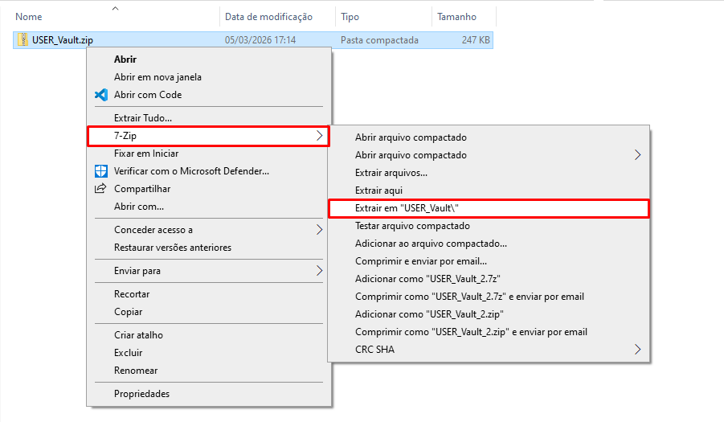

Após extraído, renomeie a parte USER da pasta extraída para seu nome para facilitar identificação. No exemplo abaixo foi renomeado para Pedro_Vault

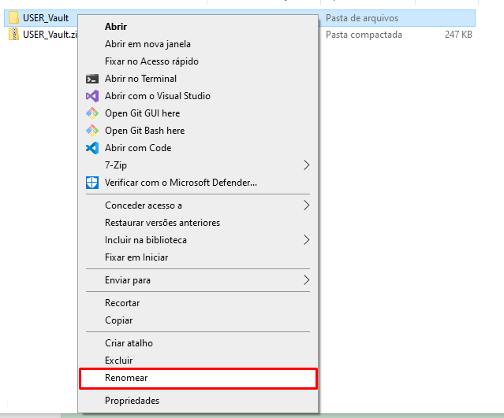
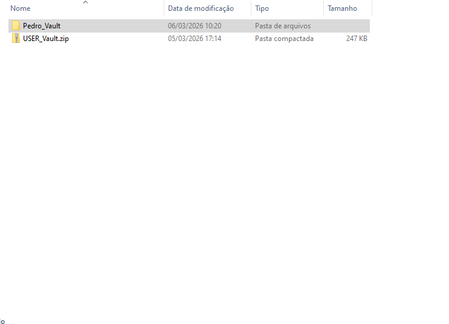

Após renomear, abra o Obsidian e clique na opção *Abrir pasta como um cofre*, em seguida selecione a pasta que acabou de ser renomeada. No caso do exemplo, irei abrir a Pedro_Vault.

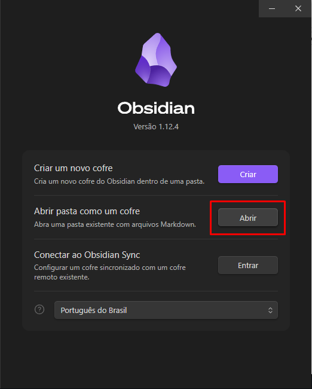
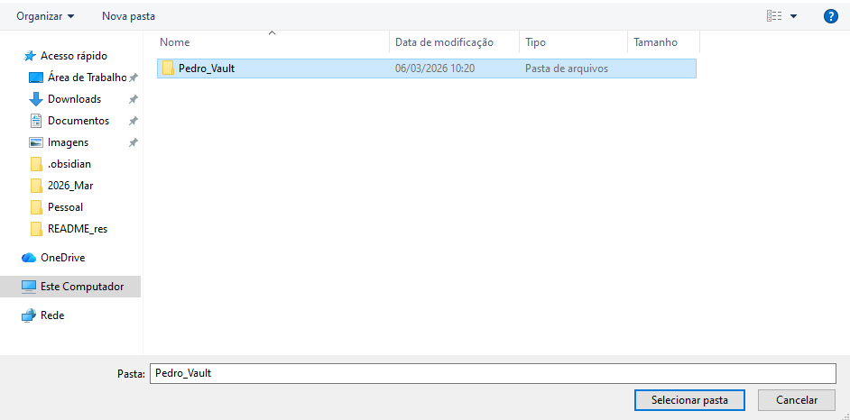

Ao abrir ele vai perguntar *"Você confia no autor deste cofre?"*. Clique em *"Confiar no autor e habilitar plugins"*

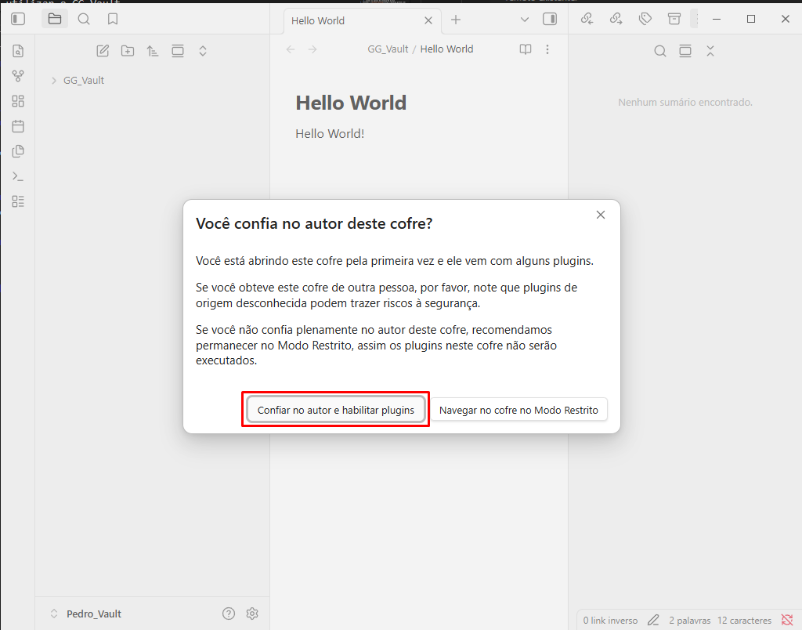

Na primeira vez que você fizer esse processo no seu computador você será solicitado para logar com o Github. Clique na opção *Sign in with your browser* e siga o processo de login no site.

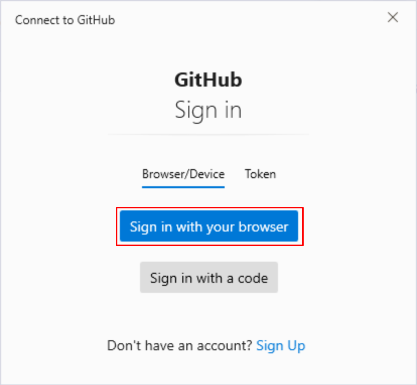
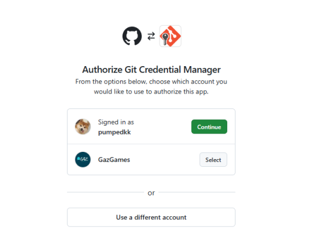
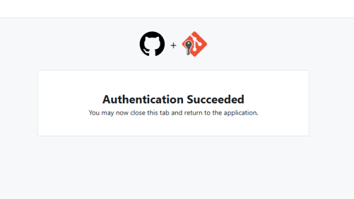

Após reiniciar o Obsidian, o GG_Vaults já estará pronto para uso.

> Se algo tiver dado errado após seguir o processo de instalação, certifique-se de ter cumprido todos os requisitos. Caso o problema persistir, verifique a sessão de Resolução de Problemas.

Como utilizar o GG_Vault
------------------------
Todos os arquivos presentes dentro da pasta *GG_Vault* dentro do Obsidian estão sincronizadas com esse repositório do Github. Qualquer arquivo fora da sua pasta *GG_Vault* não irá subir para o Github ao fazer um commit, ficando apenas localmente em seu dispositivo.

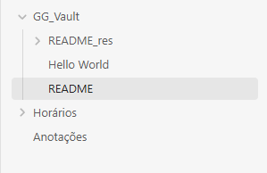

O seu GG_Vault local será atualizado automaticamente toda vez que o Obsidian for aberto e, após aberto, a cada 15 minutos.

Antes de editar/criar algum arquivo é recomendado executar o comando de *Git: Pull* para atualizar o seu repositório local, a fim de evitar conflito de arquivos.

**Importante:** Além de rodar o *Git: Pull* manualmente, deve-se avisar no canal do discord `#status-vault` qual arquivo você está editando para que apenas uma pessoa edite um mesmo arquivo por vez. Isso é necessário para evitar ao máximo conflitos com o Git.

Para executar comandos, aperte `CTRL+P`

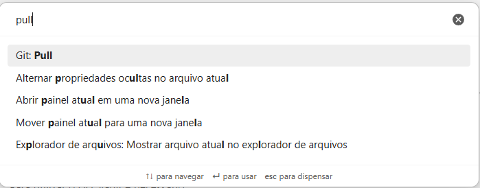

Para subir seus arquivos modificados para o repositório do Git, execute o comando *Git: Commit-and-sync with specific message*, e escreva uma mensagem descrevendo resumidamente o que foi feito e selecione a opção que apresenta a data anterior à mensagem que você escreveu. No exemplo, foi escrito a mensagem `Escrevendo o README do projeto`

Para executar comandos, aperte `CTRL+P`

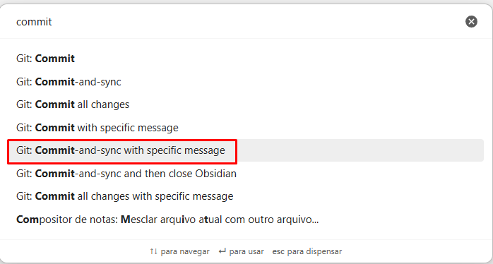

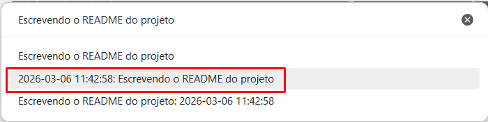

Após confirmar, o plugin vai subir suas alterações para o repositório e fazer um pull automático para manter seus arquivos locais atualizados.

Resolução de Problemas
----------------------
Essa sessão é dedicada para listar correções para erros que possam aparecer durante a utilização do GG_Vault com o *obsidian-git*. Caso você se depare com um problema que não está listado, volte aqui e atualize essa sessão ao resolve-lo.

### Meu usuário no commit do Github está diferente do meu usuário loggado.
Abra o programa Git Bash (Instalado automaticamente pelo instalador do Git) e execute o seguinte comando.

```bash
git config --list
```

Verifique no seu output as definições do `user.name` e `user.email`.

Exemplo de output:

```bash:output
[...]
filter.lfs.required=true
user.name=John Doe
user.email=john_doe_gaz_games@gmail.com
core.repositoryformatversion=0
[...]
```

Caso eles estejam diferentes da sua conta do Github, utilize os seguintes comandos para corrigi-los:

```bash:user.name
git config --global user.name "usuario do github"
```
```bash:user.email
git config --global user.email "email do github"
```